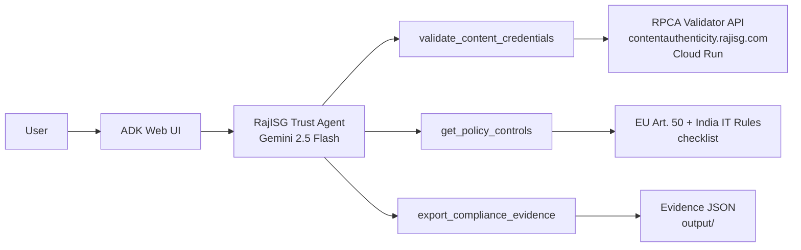

# RajISG Trust Agent — architecture

## Flow

1. User chats in ADK → agent receives file path + jurisdiction  
2. **validate_content_credentials** → POST live RPCA C2PA validator  
3. **get_policy_controls** → EU / India control library  
4. Agent maps verdict → disclosure recommendations  
5. **export_compliance_evidence** → audit JSON pack  

**Principle:** cryptographic proof first, AI reasoning second.
